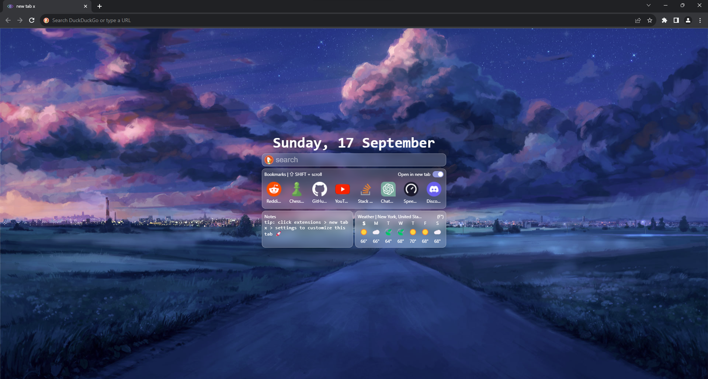
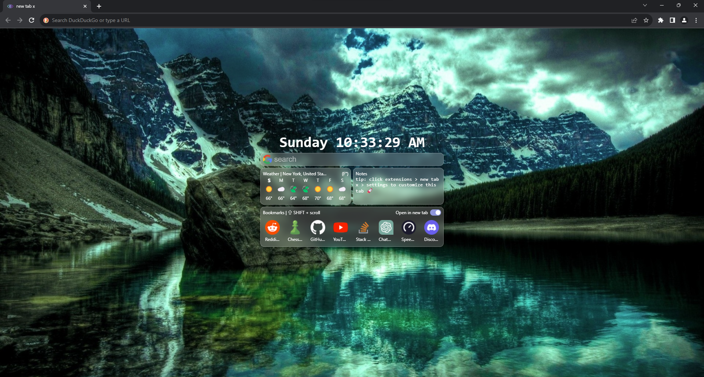

  
  <h1>new tab x</h1>

not on chrome webstore yet (you can try the developer build by using the new-tab-x-dist.zip file)

  
  

  
  

custom new tab page you can set your own:

- background
- widgets
- search engine
- more
