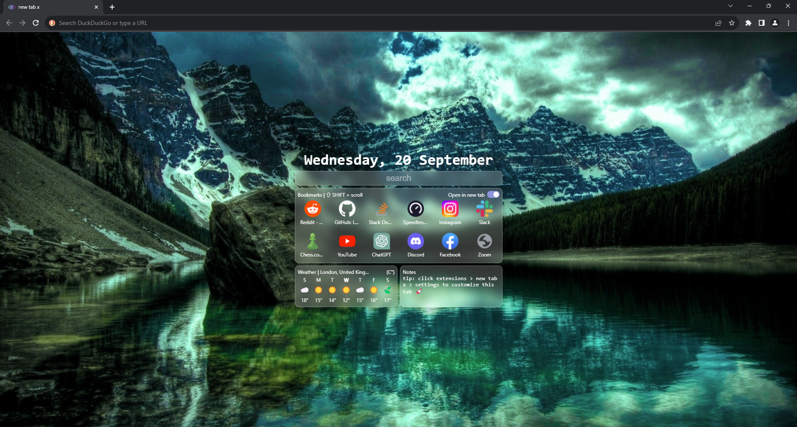
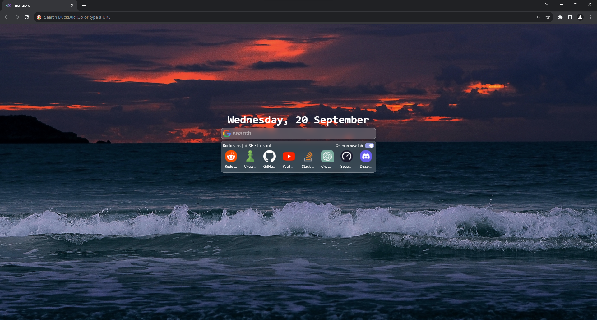
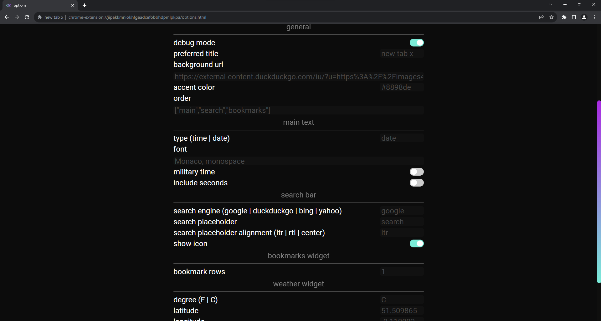

  
  <h1>new tab x</h1>

**new tab x is no longer mantained, please try out mtab: https://github.com/maxhu08/mtab**

INSTALL HERE -> https://chrome.google.com/webstore/detail/new-tab-x/kfpldldbkgdbcbkihefdddeikpkbiccb

  
  

  

  

  
  

custom new tab page you can set your own:

- background
- widgets
- search engine
- more
